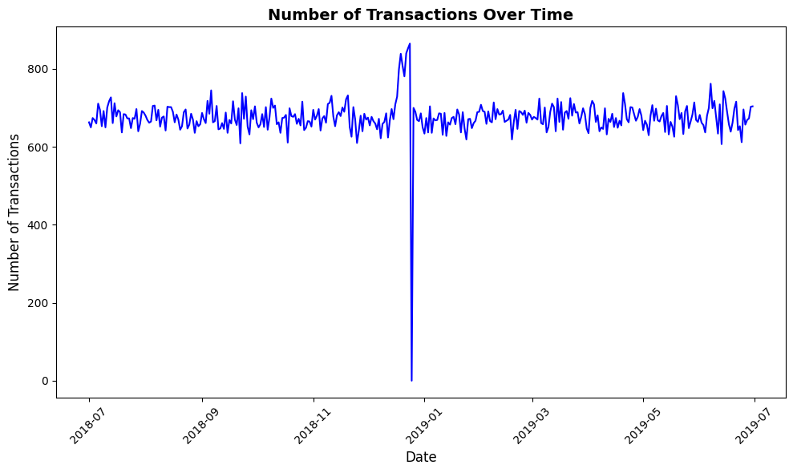
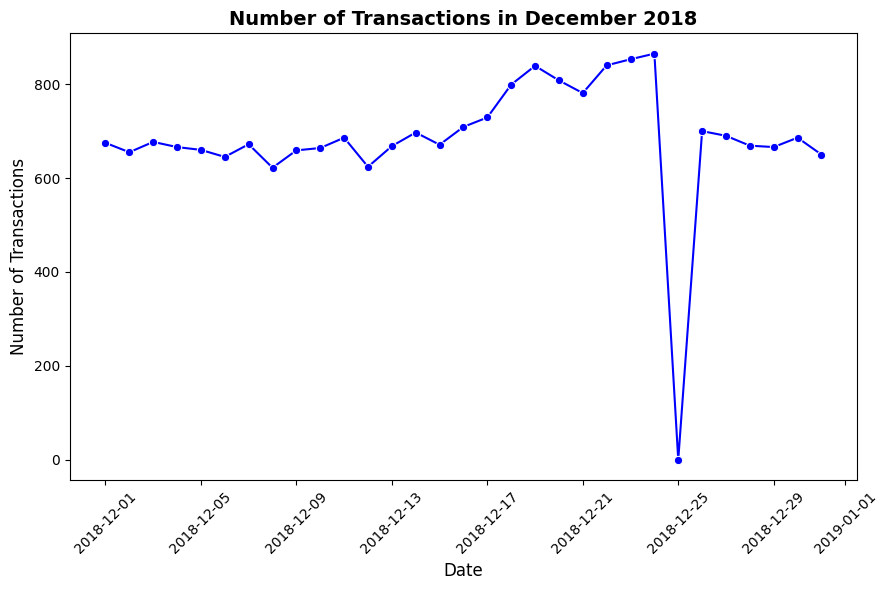
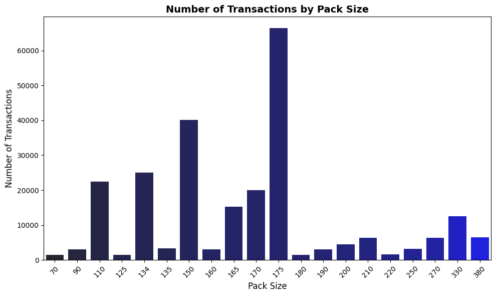
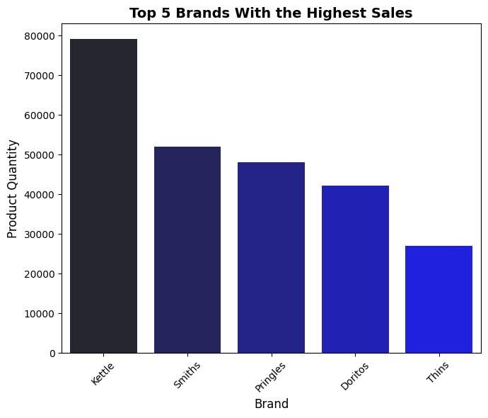
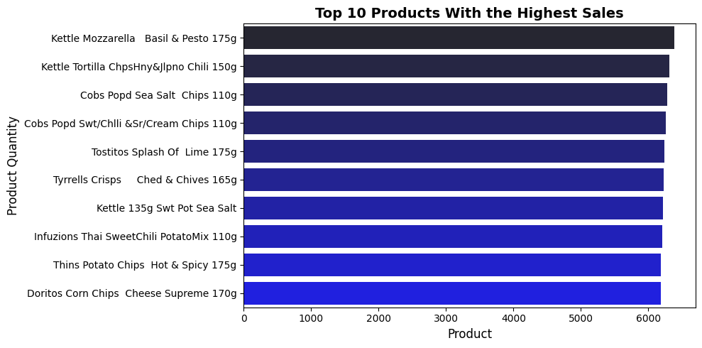
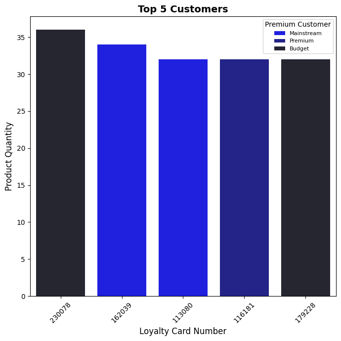
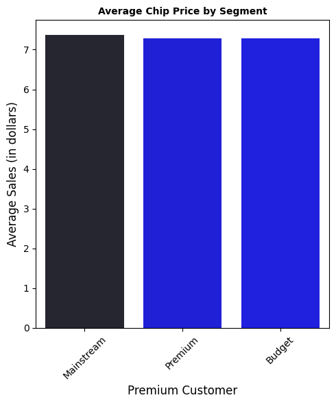
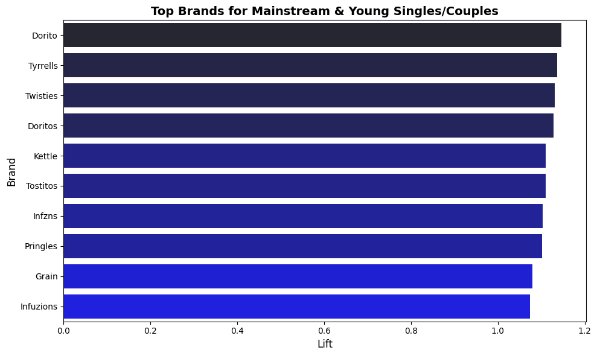
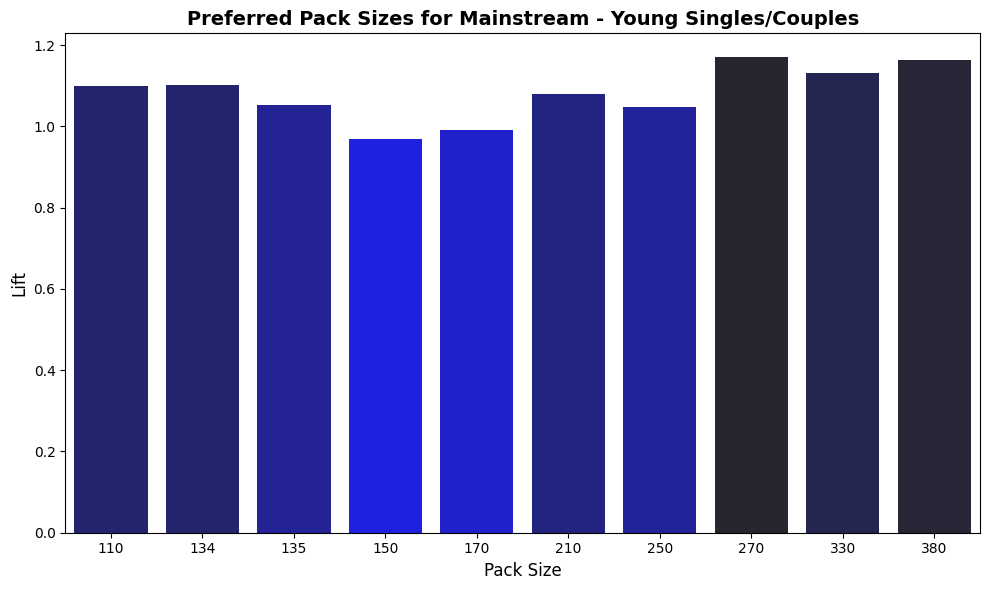

# Chips Customer Insights and Sales Analysis

## Overview
This project focuses on analyzing customer purchasing behaviors and sales trends for the chips category. By leveraging transaction and customer data, the goal is to uncover actionable insights that can inform the supermarket’s strategic plans for the next half-year.

The analysis aims to identify sales trends, understand the impact of various factors like pack size and brand preferences, and segment customers based on their spending habits. The findings will guide targeted marketing strategies and improve the overall performance of the chips category.

All credit for the dataset goes to the original creator, and I extend my gratitude to Quantium for making it accessible for analysis.

## Background
The analysis focuses on answering the following questions:

1. **What is the trend of transactions over time?**
2. **What is the trend of transactions in December only?**
3. **Does the size of the pack influence sales?**
4. **What are the top 5 purchased brands?**
5. **What are the top 10 most purchased products?**
6. **Who spends the most on chips, describing their lifestage and premium segments?**
7. **Who are the top 5 customers that purchase chips the most?**
8. **What is the average chip price by customer segment?**
9. **What are the most purchased brands by Mainstream - Young Singles/Couples?**
10. **What is the most preferred pack size by Mainstream - Young Singles/Couples?**

These questions form the core objectives of the analysis and are designed to uncover both broad and specific insights into customer purchasing behavior.

## Tools Used
- **Python**: For data cleaning, transformation, and analysis.
- **Pandas and NumPy**: For data manipulation and numerical computations.
- **Matplotlib and Seaborn**: For data visualization.
- **Jupyter Notebook**: As the primary environment for coding and documenting the analysis.
- **Excel/CSV Files**: For saving processed datasets and sharing insights.

## Methodology and Process
1. **Data Cleaning and Preparation**:
   - Examined transaction and customer datasets for inconsistencies, missing values, and outliers.
   - Corrected anomalies, such as duplicate entries or invalid data points.
   - Ensured that all numeric and date fields were correctly formatted and categorical fields were consistent.

2. **Data Merging**:
   - Merged transaction data with customer data to create a unified dataset for analysis.

3. **Analysis**:
   - **Sales Trends**: Explored transaction trends over time and focused specifically on December sales.
   - **Impact of Pack Size**: Analyzed sales distribution across various pack sizes.
   - **Top Brands and Products**: Identified the most purchased brands and products.
   - **Customer Segmentation**:
     - Segmented customers by lifestage and premium segments.
     - Examined spending habits, average chip prices, and preferences for pack size and brand.
   - **High-Spending Customers**: Highlighted top customers based on total chip purchases.

4. **Visualization**:
   - Created charts and graphs to illustrate trends, comparisons, and customer segments.

5. **Insights and Recommendations**:
   - Summarized findings and proposed strategies to enhance sales and target key customer segments.

## Challenges Faced
- **Data Quality Issues**:
  - Encountered missing and inconsistent data entries.
  - Addressed these issues by applying imputation techniques and filtering invalid data.

- **Complex Merging of Datasets**:
  - Merging transaction and customer data required careful handling of mismatched records and duplicates.

- **Handling Outliers**:
  - Significant outliers in sales data needed to be identified and either corrected or excluded from analysis to avoid skewing results.

- **Segment-Specific Analysis**:
  - Segmenting data by lifestage, premium tiers, and preferences required creating derived metrics and ensuring accurate classification.

- **Visualization Clarity**:
  - Balancing the need for detailed insights with the simplicity of visual representation posed a challenge in designing effective charts.


## Analysis

### 1. What is the trend of transactions over time?
### Methodology
To analyze the trend of transactions over time, a comprehensive approach was taken. A complete date range from July 1, 2018, to June 30, 2019, was established, and a DataFrame was created to hold this range. The transaction data was grouped by date to calculate the number of transactions per day. This grouped data was then merged with the full date range to ensure all dates were included in the final dataset. Missing transaction counts were filled with 0 to account for days with no transactions. Finally, the dataset was filtered to identify and list dates with zero transactions, enabling further investigation or reporting of potentially inactive periods. This approach provided a complete view of transaction trends over the specified period.

View my notebook with detailed steps here: [EDA_Quantium_Store.ipynb](EDA_Quantium_Store.ipynb])


### Visualize Data
```py
# Plot transaction over time
plt.figure(figsize=(10, 6))
sns.lineplot(data=merged_data, x='DATE', y='TRANSACTION_COUNT', color='blue')

# Set plot titles and labels
plt.title('Number of Transactions Over Time', fontsize=14, fontweight='bold')
plt.xlabel('Date', fontsize=12)
plt.ylabel('Number of Transactions', fontsize=12)

# Rotate x-axis labels for better readability
plt.xticks(rotation=45)

plt.tight_layout()
plt.show()
```

### Results
#### Visualization of trend of transaction over time


### Insights
- Pre-Christmas Surge: The sharp peak in November/December shows a significant increase in transactions, likely driven by holiday shopping.
- Magnitude of the Spike: The December peak far exceeds typical transaction volumes, highlighting the importance of the holiday season and the need for robust operational planning.
- Revenue Opportunity: The December surge likely translates to a major revenue boost. Preparing inventory and optimizing operations during this period can drive significant financial gains.
- Overall Growth: Aside from seasonal variations, the data shows a consistent upward trend in transaction volumes, indicating overall business growth and an expanding customer base.

### 2. What is the trend of transactions in December only?
### Methodology
I focused on analyzing transaction data specifically for December 2018. I filtered the dataset to isolate entries for this month and year. To visualize the trends, I created a line plot that displayed the number of transactions over time, highlighting the fluctuations throughout December. The plot was customized with clear labels and a bold title to ensure readability, and I adjusted the x-axis labels for better clarity. This approach allowed me to effectively highlight and interpret the transaction trends during that month.

### Visualize Data
```py
# Filter the data to only include December 2018
december_data = merged_data[(merged_data['DATE'].dt.month == 12) & (merged_data['DATE'].dt.year == 2018)]

# Plot the number of transactions in December
plt.figure(figsize=(9, 6))
sns.lineplot(data=december_data, x='DATE', y='TRANSACTION_COUNT', marker='o', color='blue')

# Set plot titles and labels
plt.title('Number of Transactions in December 2018', fontsize=14, fontweight='bold')
plt.xlabel('Date', fontsize=12)
plt.ylabel('Number of Transactions', fontsize=12)

# Rotate x-axis labels for better readability
plt.xticks(rotation=45)

plt.tight_layout()
plt.show()
```
### Results
#### Visualization of trend of transaction in December


### Insights
- Overall Increase in Transactions: Throughout December, there is a noticeable upward trend in the number of transactions, peaking towards the end of the month. This suggests a growing level of customer activity as the holiday season progresses.
- Sharp Dip Around December 25th: A significant drop in transaction volume is observed around December 25th. This could be due to reduced business activity on Christmas Day, where many businesses are closed or customers are less likely to shop.
- Post-Christmas Recovery: After the dip on Christmas Day, the number of transactions rebounds, returning to levels similar to those seen in the earlier part of December. This could indicate a resurgence in post-holiday shopping, including post-Christmas sales or last-minute purchases.
- Peak Transaction Period: The highest volume of transactions occurs just before Christmas, around December 21st–22nd, indicating a pre-Christmas shopping rush. This peak aligns with customer preparations for the holiday, highlighting the importance of this period for retail or service-based businesses.


### 3. Does the size of the pack influence sales?

### Methodology
I extracted the pack size from the PROD_NAME column by identifying and extracting the first numeric value within each product name. This was achieved using a regular expression to capture the number, which typically represents the pack size. A new column, PACK_SIZE, was created and used to analyze the distribution of transactions based on pack size. The distribution was visualized using a count plot, highlighting the number of transactions for each unique pack size.

### Visualize Data

```py
# Plot size pack over sales
plt.figure(figsize=(10, 6))
sns.countplot(data=transaction_data, x='PACK_SIZE', palette='dark:b', hue='PACK_SIZE', legend = False)

plt.title('Number of Transactions by Pack Size', fontsize=14, fontweight='bold')
plt.xlabel('Pack Size', fontsize=12)
plt.ylabel('Number of Transactions', fontsize=12)

plt.xticks(rotation=45)

plt.tight_layout()
plt.show()
```
### Results
#### Visualization of size of packs against sales


### Insights
- Dominant Pack Size: The 170g pack size is the clear leader in terms of transaction volume, indicating strong customer preference. This highlights the importance of focusing production and inventory management on this pack size to meet demand and ensure product availability.
- Demand for Larger Packs: Transaction activity for larger pack sizes, such as 160g, 165g, and 175g, also showed significant levels of engagement. This suggests a clear demand for bulk or family-sized products. Adjusting pricing strategies and exploring promotional opportunities for these larger sizes could help drive further sales growth.
- Underperformance of Smaller Packs: Smaller pack sizes, ranging from 70g to 135g, showed much lower transaction volumes compared to their larger counterparts. This underperformance indicates that these sizes may not be as appealing to customers. A review of these smaller pack offerings could help optimize the product mix, potentially phasing out underperforming sizes or adjusting their market positioning.


### 4. What are the top 5 purchased brands?
### Methodlogy

I identified the top 5 purchased brands by grouping the transaction data by the BRAND column and calculating the total quantity sold (PROD_QTY) for each brand. I then sorted the results in descending order and selected the top 5 brands with the highest total quantities. To present the findings clearly, I created a bar chart that visualizes the sales volumes of these top brands, highlighting their performance and relative popularity.

### Visualize Data
```py
# Plot top 5 brands with highests sales
plt.figure(figsize=(7, 6))
sns.barplot(data=top_5_brand, x='BRAND', y = 'PROD_QTY', palette='dark:b',hue='BRAND', legend=None)

plt.title('Top 5 Brands With the Highest Sales', fontsize=14, fontweight='bold')
plt.xlabel('Brand', fontsize=12)
plt.ylabel('Product Quantity', fontsize=12)

plt.xticks(rotation=45)

plt.tight_layout()
plt.show()
```

### Results
#### Visualization of top 5 brands


### Insights
- Dominant Brand: "Kettle" is the clear leader in sales, with a significantly higher transaction volume compared to other brands. This reflects strong customer preference and brand loyalty toward Kettle products.
- Close Competitors: Brands like "Smiths" and "Pringles" also show robust sales performance, securing the second and third spots respectively. While they trail Kettle, their consistent transaction volumes demonstrate their market strength.
- Steady Performance by Others: "Doritos" and "Thins" occupy the fourth and fifth positions, contributing meaningfully to the overall sales. However, they lag noticeably behind the top three brands, indicating room for growth.

#### Recommendations: 
- Maximize Kettle's popularity through prominent shelf placement and consistent stock levels. 
- Implement cross-promotions between high and low-performing brands to boost overall sales. 
- For underperforming brands, introduce targeted promotions while optimizing shelf space allocation based on sales performance.

### 5. What are the top 10 most purchased products?
### Methodology:
I analyzed the top-selling products by aggregating the transaction data using Python pandas. I grouped the sales by product names and calculated their total quantities sold. To identify the best performers, I sorted these totals in descending order and extracted the top 10 products. I then created a horizontal bar chart visualization to clearly display the sales distribution across these leading products.

### Visualize Data
```py
# Plot top10 most purchased products
plt.figure(figsize=(10, 5))
sns.barplot(data=top_10_products, y='PROD_NAME', x = 'PROD_QTY', palette='dark:b', hue='PROD_NAME', legend=None)

plt.title('Top 10 Products With the Highest Sales', fontsize=14, fontweight='bold')
plt.xlabel('Product', fontsize=12)
plt.ylabel('Product Quantity', fontsize=12)

#plt.xticks(rotation=45)

plt.tight_layout()
plt.show()
```
### Results
#### Visualization of top 10 products with highest sales


### Insights:
The analysis revealed Kettle Mozzarella, Basil & Pesto (175g) as the highest-selling product, followed closely by Kettle Tortilla Chips in Honey & Jalapeño Chili flavor. Cobs Popcorn variants (both Sea Salt and Sweet Chili & Sour Cream) secured strong positions in the top 4, showing significant customer preference.

#### Key observations:

- Kettle brand appears multiple times in the top 10, showing strong brand performance
- Diverse flavor profiles are represented, from classic (Sea Salt) to exotic (Thai Sweet Chili)
- Mix of different snack types including potato chips, corn chips, tortilla chips, and popcorn
- Premium brands (Kettle, Tyrrells) show strong performance
- Spicy and flavored variants appear frequently in the top-selling products

#### Recommendations:
- Maintain higher stock levels of Kettle products, particularly their Mozzarella and Jalapeño varieties. 
- Consider creating premium product displays featuring the top-selling Kettle and Tyrrells items. 
- Introduce bundle deals combining high-performing popcorn varieties with chips to boost overall sales. 
- Ensure consistent availability of spicy and flavored variants as they appear frequently among top sellers.


### 6. Who spends the most on chips, describing their lifestage and premium segments?

### Methodology:
I examined customer spending patterns by combining lifestage and premium customer segments. I grouped the transaction data by these two demographic variables and calculated total sales for each segment combination. To visualize these patterns, I created a bar chart that displays total chip sales across different lifestages, with colors distinguishing between budget and mainstream customers.

### Visualize Data
```py
# Plot the result
plt.figure(figsize=(8, 7))
sns.barplot(data=top_spenders, x='LIFESTAGE', y='TOT_SALES', hue='PREMIUM_CUSTOMER', palette='dark:b')

plt.title('Total Chip Sales by LIFESTAGE and PREMIUM_CUSTOMER', fontsize=14, fontweight='bold')
plt.xlabel('LIFESTAGE', fontsize=12)
plt.ylabel('Total Sales (in dollars)', fontsize=12)

plt.xticks(rotation=45)
plt.legend(title='Premium Customer', fontsize=8, title_fontsize=10, loc='upper right')

plt.tight_layout()
plt.show()
```
### Results
#### Visualization of highest chips spender based on lifesatge amd premium


### Insights:
The analysis revealed that OLDER FAMILIES emerge as the highest spenders on chips, particularly those in the budget category, with total sales reaching approximately 160,000 dollars. Following closely are YOUNG SINGLES/COUPLES and RETIREES in the mainstream segment, both showing strong sales around 145,000 dollars. YOUNG FAMILIES and OLDER SINGLES/COUPLES demonstrate relatively lower spending patterns, but still contribute significantly to overall sales. Notably, mainstream customers show consistent high spending across several lifestages, particularly in the young to retired age groups.

#### Recommendations:

- Develop targeted promotions for Older Families in the budget segment, such as bulk-buy discounts or family-size value packs
- Create premium product offerings for Young Singles/Couples in the mainstream segment, focusing on innovative flavors and healthier options
- Design loyalty programs specifically tailored to Retirees in the mainstream segment, emphasizing quality and value
- Introduce mid-week specials targeting Young Families to boost their engagement and increase their spending
- Consider implementing "premium tasting" events for Older Singles/Couples to encourage trading up to mainstream products

### 7. Who are the top 5 customers that purchase chips the most?
### Methodology:
I analyzed individual customer purchasing behavior by aggregating the quantity of chips bought per loyalty card number. I combined this with their premium customer status to understand if high-volume purchasers tend to be from specific customer segments. I sorted these totals in descending order to identify our top 5 most frequent chip purchasers.

### Visualize Data
```py
# Plot top 5 customers by number of purchase
plt.figure(figsize=(7, 7))
sns.barplot(data=chips_per_customer_sorted, x='LYLTY_CARD_NBR', y='PROD_QTY', hue='PREMIUM_CUSTOMER', 
            palette='dark:b_r', order=chips_per_customer_sorted['LYLTY_CARD_NBR'])

plt.title('Top 5 Customers', fontsize=14, fontweight='bold')
plt.xlabel('Loyalty Card Number', fontsize=12)
plt.ylabel('Product Quantity', fontsize=12)
plt.xticks(rotation=45)

plt.legend(title='Premium Customer', fontsize=8, title_fontsize=10, loc='upper right')

plt.tight_layout()
plt.show()

```
### Results
#### Visualization of top 5 customers


### Insights:
From the data analysis, I identified the top 5 chip-purchasing customers by their loyalty card numbers, ordered by total quantity purchased. Notably, these customers show significantly higher purchase volumes compared to the average customer, indicating strong brand loyalty or potential business purchases. The premium customer classification of these top purchasers gives us valuable insights into whether high-volume buying correlates with specific customer segments.

#### Recommendations
- Create a VIP program specifically targeting high-volume purchasers, offering exclusive discounts and early access to new products
- Implement a personalized communication strategy for top customers to maintain their loyalty and gather feedback
- Design volume-based incentives to encourage other customers to increase their purchase quantities
- Analyze the purchasing patterns of these top customers to identify potential business-to-business opportunities
- Consider developing a tier-based reward system that recognizes and rewards high-volume purchasers with special benefits

### 8. What is the average chip price by customer segment?

### Methodology
I analyzed customer sales data to explore differences in spending among Mainstream, Premium, and Budget customers. Using Python, I calculated the average sales for each segment and visualized the results with a bar chart to identify trends and spending patterns.

### Visualize Data
```py
# Plot average chip price by segment
plt.figure(figsize=(5, 6))
sns.barplot(data =avg_chip_price, x='PREMIUM_CUSTOMER', y='TOT_SALES', palette='dark:b_r',hue= 'TOT_SALES', legend = None)

plt.title('Average Chip Price by Segment', fontsize=10, fontweight='bold')
plt.xlabel('Premium Customer', fontsize=12)
plt.ylabel('Average Sales (in dollars)', fontsize=12)

plt.xticks(rotation=45)

plt.tight_layout()
plt.show()
```
### Results
#### Visualization of average chip price by segment


### Insights
- Premium and Budget customers spend nearly the same on average, slightly more than Mainstream customers.
- Spending uniformity suggests standardized pricing or similar consumer responses across segments.
- Mainstream customers show marginally lower engagement, indicating potential for improvement.

#### Recommendations
- Personalize strategies: exclusive offers for Premium customers and volume discounts for Budget.
- Target Mainstream customers with campaigns to boost purchase frequency or basket size.
- Explore deeper segmentation and test pricing strategies to uncover additional opportunities.


9. What are the most purchased brands by Mainstream - Young Singles/Couples?
### Methodology
To identify the most purchased brands by Mainstream - Young Singles/Couples, I filtered the dataset for this segment and calculated each brand’s share of total sales. I then compared these proportions to overall brand sales across all customers, using lift to measure how much more likely this segment is to purchase a brand compared to others. The brands with the highest lift scores were identified as the most preferred by this segment.

### Visualize Data
```py
#plot top brands bought by mainstream and young singles/couples
plt.figure(figsize=(10, 6))
sns.barplot(data=brand_analysis_sorted.head(10).sort_values(by='LIFT', ascending= False), x='LIFT', y='BRAND', 
            palette='dark:b_r',  hue='LIFT', legend= None)

plt.title("Top Brands for Mainstream & Young Singles/Couples", fontsize=14, fontweight='bold')
plt.xlabel("Lift", fontsize=12)
plt.ylabel("Brand", fontsize=12)

plt.tight_layout()
plt.show()
```
### Results
#### Visualization of rands bought by mainstream and young singles/couples


### Insights
- Top-performing brands: The brands with the highest lift are Dorito, Tyrrells, Twisties, and Doritos, indicating their strong popularity among Mainstream shoppers and Young Singles/Couples.
- Mid-range brands: Kettle, Tostitos, Infzns, and Pringles also have good lift, suggesting they are well-received by these segments.
- Lower-performing brands: Grain and Infusions have the lowest lift, implying a potential opportunity for improvement.

#### Recommendations:

- Inventory management:
Ensure ample stock of top-performing brands (Doritos, Tyrrells, Twisties, Doritos) to meet demand.
Maintain appropriate stock levels for mid-range brands (Kettle, Tostitos, Infzns, Pringles) based on sales data.
Product placement:
Place top-performing brands in prominent locations for increased visibility and impulse purchases.
Consider placing lower-performing brands (Grain, Infusions) in strategic locations or alongside complementary products to drive sales.
- Marketing and promotions:
Run promotions or bundles featuring top-performing brands to further incentivize purchases.
Develop targeted marketing campaigns to promote lower-performing brands and raise awareness among the target segments.
- Product variety and innovation:
  Evaluate the product variety within lower-performing brands (Grain, Infusions) and consider expanding options to attract customers.
Explore potential product innovation or improvements to enhance the appeal of these brands.

### 10. What is the most preferred pack size by Mainstream - Young Singles/Couples?

### Methodology
To determine the most preferred pack size by Mainstream - Young Singles/Couples, I filtered the dataset for this specific segment and calculated the total sales for each pack size. Each pack size's proportion of total segment sales was then computed to identify preferences.

Next, I calculated overall pack size proportions across all customers and used lift as a measure to compare the segment's preferences against the overall population. Pack sizes with the highest lift scores indicate the strongest affinity for this group. The results were sorted by lift to reveal the most preferred pack sizes by the Mainstream - Young Singles/Couples segment.

### Visualize Data
```py
plt.figure(figsize=(10, 6))
sns.barplot(data=pack_analysis_sorted.head(10).sort_values(by='LIFT',ascending=False), x='PACK_SIZE', y='LIFT', 
            palette='dark:b_r', hue='LIFT', legend= None)

plt.title("Preferred Pack Sizes for Mainstream - Young Singles/Couples", fontsize=14, fontweight='bold')
plt.xlabel("Pack Size", fontsize=12)
plt.ylabel("Lift", fontsize=12)
plt.tight_layout()
plt.show()

```
### Results
#### Visualization of preferred pack



### Insights:

- The preferred pack sizes for mainstream young singles/couples range from 110 to 380, with the most common sizes being 150, 170, 210, and 250.
- The pack sizes with the highest "lift" (i.e., relative preference) are 270, 330, and 380, indicating that these larger pack sizes are more preferred by this target audience compared to the smaller pack sizes.
- The pack sizes with the lowest "lift" are 110, 134, and 135, suggesting that these smaller pack sizes are less preferred by young singles/couples.

#### Recommendations:
- Focus on stocking the more preferred pack sizes of 150, 170, 210, and 250, as these appear to be the most popular among the target audience.
- Consider offering the larger pack sizes of 270, 330, and 380 as well, as these seem to have a higher relative preference among young singles/couples.
- Minimize the availability of the smaller pack sizes of 110, 134, and 135, as they appear to be less preferred by this target audience.
- Continuously monitor and adjust the pack size offerings based on customer feedback and sales data to ensure you are meeting the preferences of your young singles/couples customer base


## What I Learnt in this Project
Through this comprehensive chips category analysis, I gained valuable insights and expanded my skills in several key areas:

- Python Proficiency: I leveraged Python's powerful libraries to efficiently manipulate, analyze, and visualize the complex dataset, deepening my understanding of Python's capabilities in data analytics.

- Data Cleaning Importance: Working with the provided data highlighted the critical role of data preparation and transformation, reinforcing the significance of ensuring data quality and reliability.

- Visualization Expertise: Mastering visualization tools equipped me with the ability to create compelling and impactful data visualizations, a skill that will be invaluable in effectively communicating insights.

- Project Management: Structuring and executing this comprehensive data analysis project enhanced my overall project management capabilities, which will be essential for tackling complex, data-driven initiatives.

## Overall Key Insights
- The holiday season, particularly December, is a crucial period for the business, with a significant surge in customer activity and sales.
- Customers have a strong preference for larger pack sizes, suggesting a demand for bulk or family-oriented products.
- The Kettle brand is the dominant market leader, with its products consistently among the top-selling items.
- Customers are drawn to a diverse range of snack types, with a preference for premium and flavored variants.

## Overall Recommendations
- Optimize inventory and operations to capitalize on the holiday season surge, ensuring adequate stock levels and efficient fulfillment.
- Expand the offering of larger pack sizes to cater to the demand for bulk or family-sized products.
- Prioritize the Kettle brand, ensuring prominent shelf placement and consistent stock availability to maintain its market leadership.
- Introduce more premium and flavored product variants to align with customer preferences, while also exploring opportunities to cross-promote between high and low-performing brands.

## Conclusion
This comprehensive analysis of the chips category data provided valuable insights that can inform the supermarket's strategic plans for the next half-year. By understanding customer purchasing behaviors, sales trends, and the impact of various factors, the business can make data-driven decisions to optimize inventory, marketing, and product offerings. The learnings from this project will be instrumental in driving the growth and success of the chips category.